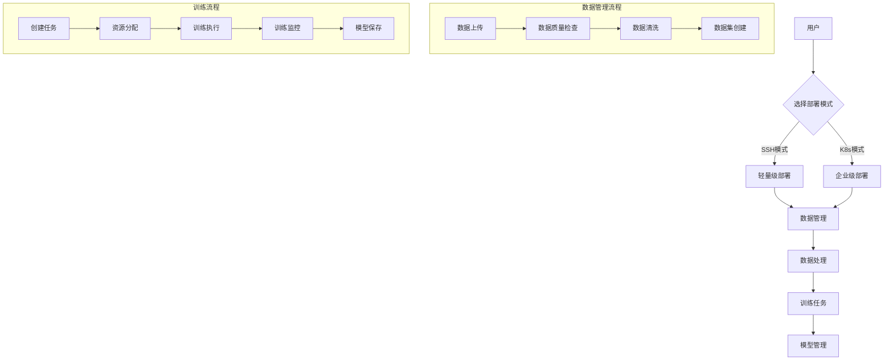
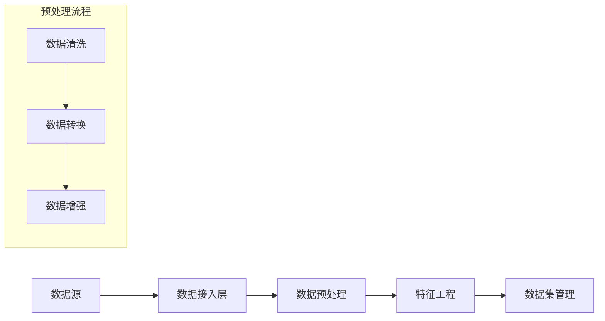
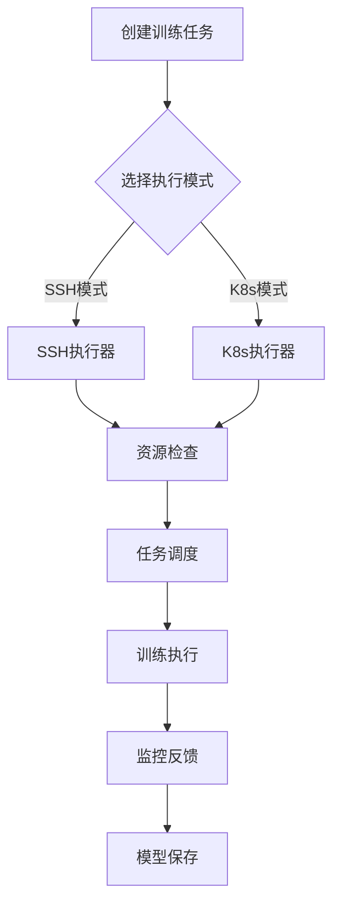

# AI训练平台详细设计文档（最终版）

## 一、系统概述

### 1.1 设计目标
构建一个基于RuoYi Spring Cloud的AI训练平台，支持：
- 个人用户到企业级的灵活部署方案
- K8s集群和SSH直连两种运行模式
- 数据管理到模型训练的完整AI开发流程
- 轻量级设计，支持按需扩展

### 1.2 技术特点
- 基础框架：RuoYi Spring Cloud
- 微服务架构：Spring Cloud Alibaba
- 双模式部署：K8s集群/SSH直连
- 混合语言：Java微服务 + Python AI服务

## 二、系统架构

### 2.1 整体架构
```
[前端层 Vue3]
    ↓
[网关层 Gateway]
    ↓
[基础微服务]
├── 认证中心 (aiplatform-auth)
├── 系统服务 (aiplatform-system)
└── 通用模块 (aiplatform-common)
    ↓
[AI训练微服务]
├── 数据服务 (aiplatform-dataset)
├── 训练服务 (aiplatform-training)
└── 资源服务 (aiplatform-resource)
    ↓
[Python服务集群]
├── 训练执行服务
├── 数据处理服务
└── 模型服务
    ↓
[基础设施层]
├── Nacos：服务注册与配置
├── MySQL：业务数据
├── Redis：缓存服务
├── MinIO：对象存储
└── MongoDB：非结构化数据
```

### 2.2 服务职责

#### 1. 基础微服务（RuoYi）
```
aiplatform-auth：认证中心
├── 用户认证
├── 权限管理
└── 令牌管理

aiplatform-system：系统服务
├── 用户管理
├── 角色管理
└── 系统配置

aiplatform-common：通用模块
├── 核心工具
├── 安全组件
├── 日志组件
└── 缓存组件
```

#### 2. AI训练微服务（新增）
```
aiplatform-dataset：数据服务
├── 数据集管理
├── 数据质量管理
├── 数据处理流水线
└── 数据同步管理

aiplatform-training：训练服务
├── 训练任务管理
├── 训练监控系统
├── 模型管理
└── 训练流程编排

aiplatform-resource：资源服务
├── 计算资源管理
├── SSH连接池管理
├── K8s集群管理
└── 资源监控告警
```

#### 3. Python服务（新增）
```
training-service：训练执行
├── 训练脚本执行
├── 训练过程监控
└── 模型评估

data-process-service：数据处理
├── 数据预处理
├── 数据增强
└── 特征工程

model-service：模型服务
├── 模型存储
├── 模型评估
└── 模型转换
```

## 三、系统流程图

### 3.1 整体业务流程


### 3.2 数据处理流程


### 3.3 训练任务流程


## 四、模块详细设计

### 4.1 数据管理模块

#### 4.1.1 数据集管理实现
```java
@Service
public class DatasetServiceImpl implements DatasetService {
    @Autowired
    private DatasetMapper datasetMapper;
    @Autowired
    private MinioTemplate minioTemplate;
    
    @Override
    public Dataset createDataset(DatasetDTO dto) {
        // 1. 验证数据集信息
        validateDatasetInfo(dto);
        
        // 2. 创建存储路径
        String storagePath = generateStoragePath(dto);
        
        // 3. 保存数据集元信息
        Dataset dataset = new Dataset();
        BeanUtils.copyProperties(dto, dataset);
        dataset.setStoragePath(storagePath);
        dataset.setStatus(DatasetStatus.CREATED);
        datasetMapper.insert(dataset);
        
        // 4. 初始化存储空间
        initializeStorage(dataset);
        
        return dataset;
    }
    
    @Override
    public void uploadData(String datasetId, MultipartFile file) {
        // 1. 获取数据集信息
        Dataset dataset = datasetMapper.selectById(datasetId);
        
        // 2. 文件处理
        String fileName = generateFileName(file);
        String objectName = dataset.getStoragePath() + "/" + fileName;
        
        // 3. 上传到MinIO
        minioTemplate.putObject(objectName, file.getInputStream());
        
        // 4. 更新数据集信息
        updateDatasetStats(dataset, file);
    }
}
```

#### 4.1.2 数据质量管理实现
```java
@Service
public class DataQualityServiceImpl implements DataQualityService {
    @Autowired
    private QualityCheckExecutor qualityCheckExecutor;
    @Autowired
    private QualityReportMapper reportMapper;
    
    @Override
    public QualityReport checkQuality(String datasetId) {
        // 1. 创建质量检查任务
        QualityCheckTask task = createQualityCheckTask(datasetId);
        
        // 2. 执行质量检查
        QualityCheckResult result = qualityCheckExecutor.execute(task);
        
        // 3. 保存检查报告
        QualityReport report = generateReport(result);
        reportMapper.insert(report);
        
        return report;
    }
    
    private QualityCheckTask createQualityCheckTask(String datasetId) {
        return QualityCheckTask.builder()
            .datasetId(datasetId)
            .checkItems(Arrays.asList(
                CheckItem.COMPLETENESS,
                CheckItem.ANOMALY,
                CheckItem.DUPLICATE
            ))
            .build();
    }
}
```

#### 4.1.3 数据上传服务实现
```java
@Service
public class DataUploadServiceImpl implements DataUploadService {
    @Autowired
    private MinioTemplate minioTemplate;
    @Autowired
    private DatasetMapper datasetMapper;
    @Autowired
    private ChunkUploadMapper chunkUploadMapper;
    
    @Override
    public UploadResult uploadChunk(MultipartFile file, ChunkInfo chunkInfo) {
        // 1. 验证分片信息
        validateChunkInfo(chunkInfo);
        
        // 2. 保存分片
        String chunkPath = generateChunkPath(chunkInfo);
        minioTemplate.putObject(chunkPath, file.getInputStream());
        
        // 3. 记录分片信息
        saveChunkInfo(chunkInfo, chunkPath);
        
        // 4. 检查是否所有分片都已上传
        if (isUploadComplete(chunkInfo.getIdentifier())) {
            return mergeChunks(chunkInfo);
        }
        
        return UploadResult.chunk();
    }
    
    @Override
    @Transactional
    public UploadResult mergeChunks(ChunkInfo chunkInfo) {
        // 1. 获取所有分片信息
        List<ChunkUpload> chunks = chunkUploadMapper.findByIdentifier(chunkInfo.getIdentifier());
        
        // 2. 合并文件
        String targetPath = generateTargetPath(chunkInfo);
        minioTemplate.mergeObjects(chunks.stream()
            .map(ChunkUpload::getChunkPath)
            .collect(Collectors.toList()), targetPath);
            
        // 3. 更新数据集信息
        updateDatasetInfo(chunkInfo, targetPath);
        
        // 4. 清理分片
        cleanupChunks(chunks);
        
        return UploadResult.complete(targetPath);
    }
    
    @Override
    public void validateFile(String md5, Long size) {
        // 1. 检查文件是否已存在
        if (datasetMapper.existsByMd5(md5)) {
            throw new FileExistsException();
        }
        
        // 2. 检查存储空间
        checkStorageSpace(size);
        
        // 3. 预分配存储空间
        reserveStorageSpace(size);
    }
}
```

#### 4.1.4 数据预处理服务实现
```python
from fastapi import FastAPI, File, UploadFile
from typing import List
import pandas as pd
import numpy as np

app = FastAPI()

class DataPreprocessor:
    def __init__(self):
        self.supported_formats = ['csv', 'json', 'parquet']
        
    async def preprocess_file(self, file: UploadFile) -> dict:
        # 1. 验证文件格式
        file_format = self._get_file_format(file.filename)
        if file_format not in self.supported_formats:
            raise ValueError(f"Unsupported format: {file_format}")
        
        # 2. 读取数据
        df = await self._read_file(file, file_format)
        
        # 3. 基础数据分析
        analysis = self._analyze_data(df)
        
        # 4. 数据清洗
        cleaned_df = self._clean_data(df)
        
        # 5. 特征处理
        processed_df = self._process_features(cleaned_df)
        
        return {
            'analysis': analysis,
            'processed_data': processed_df.to_dict(),
            'feature_stats': self._get_feature_stats(processed_df)
        }
    
    def _analyze_data(self, df: pd.DataFrame) -> dict:
        return {
            'row_count': len(df),
            'column_stats': {
                col: {
                    'type': str(df[col].dtype),
                    'missing': df[col].isnull().sum(),
                    'unique': df[col].nunique()
                } for col in df.columns
            }
        }
    
    def _clean_data(self, df: pd.DataFrame) -> pd.DataFrame:
        # 1. 处理缺失值
        df = self._handle_missing_values(df)
        
        # 2. 处理异常值
        df = self._handle_outliers(df)
        
        # 3. 数据类型转换
        df = self._convert_datatypes(df)
        
        return df
    
    def _process_features(self, df: pd.DataFrame) -> pd.DataFrame:
        # 1. 特征编码
        df = self._encode_categorical_features(df)
        
        # 2. 特征缩放
        df = self._scale_numerical_features(df)
        
        # 3. 特征选择
        df = self._select_features(df)
        
        return df

@app.post("/preprocess")
async def preprocess_data(file: UploadFile):
    preprocessor = DataPreprocessor()
    result = await preprocessor.preprocess_file(file)
    return result
```

#### 4.1.5 分布式存储实现
```java
@Service
public class DistributedStorageService {
    @Autowired
    private MinioTemplate minioTemplate;
    
    @Value("${storage.shared.path}")
    private String sharedStoragePath;
    
    /**
     * 创建共享存储目录
     */
    public void createSharedStorage(String datasetId) {
        String path = generateSharedPath(datasetId);
        minioTemplate.createBucket(path);
        
        // 设置共享策略
        BucketPolicy policy = new BucketPolicy();
        policy.setVersion("2012-10-17");
        policy.addStatement(Statement.builder()
            .effect(Statement.Effect.ALLOW)
            .principal("*")
            .action(Arrays.asList("s3:GetObject", "s3:ListBucket"))
            .resource(Arrays.asList(
                path + "/*",
                path
            ))
            .build());
        
        minioTemplate.setBucketPolicy(path, policy);
    }
    
    /**
     * 生成数据集挂载配置
     */
    public StorageMount generateMountConfig(String datasetId) {
        return StorageMount.builder()
            .type("s3")
            .source(generateSharedPath(datasetId))
            .target("/data")
            .options(Map.of(
                "endpoint", minioTemplate.getEndpoint(),
                "access-key", minioTemplate.getAccessKey(),
                "secret-key", minioTemplate.getSecretKey()
            ))
            .build();
    }
}

@Service
public class DataProcessPipelineService {
    @Autowired
    private DistributedStorageService storageService;
    
    /**
     * 创建数据处理流水线
     */
    public Pipeline createPipeline(PipelineConfig config) {
        // 1. 创建流水线定义
        Pipeline pipeline = Pipeline.builder()
            .name(config.getName())
            .stages(Arrays.asList(
                createLoadStage(config),
                createPreprocessStage(config),
                createTransformStage(config),
                createValidationStage(config)
            ))
            .build();
        
        // 2. 配置存储
        StorageMount mount = storageService.generateMountConfig(config.getDatasetId());
        pipeline.setStorageMount(mount);
        
        return pipeline;
    }
    
    /**
     * 执行流水线
     */
    public PipelineExecution executePipeline(Pipeline pipeline) {
        // 1. 准备执行环境
        ExecutionContext context = prepareContext(pipeline);
        
        // 2. 顺序执行各阶段
        for (Stage stage : pipeline.getStages()) {
            StageResult result = executeStage(stage, context);
            if (!result.isSuccess()) {
                return PipelineExecution.failed(result.getError());
            }
            context.updateState(result);
        }
        
        return PipelineExecution.success(context.getResults());
    }
}
```

### 4.1.6 数据处理流水线实现
```python
from typing import List, Dict, Any
import numpy as np
import pandas as pd
from sklearn.preprocessing import StandardScaler, LabelEncoder

class DataPipeline:
    def __init__(self, config: Dict[str, Any]):
        self.config = config
        self.stages = []
        self.state = {}
        
    def add_stage(self, stage: 'PipelineStage'):
        self.stages.append(stage)
        
    def execute(self, data: Any) -> Any:
        current_data = data
        for stage in self.stages:
            current_data = stage.execute(current_data)
            self.state[stage.name] = stage.get_state()
        return current_data
        
    def save_state(self, path: str):
        """保存流水线状态，用于后续复用"""
        state = {
            'config': self.config,
            'stages': self.state
        }
        np.save(path, state)
        
    @classmethod
    def load_state(cls, path: str) -> 'DataPipeline':
        """加载已有流水线状态"""
        state = np.load(path, allow_pickle=True).item()
        pipeline = cls(state['config'])
        pipeline.state = state['stages']
        return pipeline

class PipelineStage:
    def __init__(self, name: str, config: Dict[str, Any]):
        self.name = name
        self.config = config
        
    def execute(self, data: Any) -> Any:
        raise NotImplementedError
        
    def get_state(self) -> Dict[str, Any]:
        raise NotImplementedError

class DataLoadStage(PipelineStage):
    def execute(self, data_path: str) -> pd.DataFrame:
        if data_path.endswith('.csv'):
            return pd.read_csv(data_path)
        elif data_path.endswith('.parquet'):
            return pd.read_parquet(data_path)
        else:
            raise ValueError(f"Unsupported file format: {data_path}")

class PreprocessStage(PipelineStage):
    def __init__(self, name: str, config: Dict[str, Any]):
        super().__init__(name, config)
        self.scalers = {}
        self.encoders = {}
        
    def execute(self, df: pd.DataFrame) -> pd.DataFrame:
        # 1. 处理缺失值
        df = self._handle_missing(df)
        
        # 2. 数值特征标准化
        df = self._standardize_numeric(df)
        
        # 3. 类别特征编码
        df = self._encode_categorical(df)
        
        return df
        
    def _handle_missing(self, df: pd.DataFrame) -> pd.DataFrame:
        strategy = self.config.get('missing_strategy', 'mean')
        for col in df.select_dtypes(include=[np.number]).columns:
            if strategy == 'mean':
                df[col].fillna(df[col].mean(), inplace=True)
            elif strategy == 'median':
                df[col].fillna(df[col].median(), inplace=True)
        return df
        
    def _standardize_numeric(self, df: pd.DataFrame) -> pd.DataFrame:
        numeric_cols = df.select_dtypes(include=[np.number]).columns
        for col in numeric_cols:
            if col not in self.scalers:
                self.scalers[col] = StandardScaler()
                df[col] = self.scalers[col].fit_transform(df[[col]])
            else:
                df[col] = self.scalers[col].transform(df[[col]])
        return df
        
    def _encode_categorical(self, df: pd.DataFrame) -> pd.DataFrame:
        categorical_cols = df.select_dtypes(include=['object']).columns
        for col in categorical_cols:
            if col not in self.encoders:
                self.encoders[col] = LabelEncoder()
                df[col] = self.encoders[col].fit_transform(df[col])
            else:
                df[col] = self.encoders[col].transform(df[col])
        return df
        
    def get_state(self) -> Dict[str, Any]:
        return {
            'scalers': self.scalers,
            'encoders': self.encoders
        }

class ValidationStage(PipelineStage):
    def execute(self, df: pd.DataFrame) -> pd.DataFrame:
        # 1. 检查数据类型
        self._validate_dtypes(df)
        
        # 2. 检查取值范围
        self._validate_ranges(df)
        
        # 3. 检查唯一性约束
        self._validate_unique(df)
        
        return df
        
    def _validate_dtypes(self, df: pd.DataFrame):
        expected_dtypes = self.config.get('expected_dtypes', {})
        for col, dtype in expected_dtypes.items():
            if col in df and str(df[col].dtype) != dtype:
                raise ValueError(f"Column {col} has wrong dtype: {df[col].dtype}")
                
    def _validate_ranges(self, df: pd.DataFrame):
        ranges = self.config.get('ranges', {})
        for col, range_spec in ranges.items():
            if col in df:
                if df[col].min() < range_spec['min'] or df[col].max() > range_spec['max']:
                    raise ValueError(f"Column {col} has values outside allowed range")
                    
    def _validate_unique(self, df: pd.DataFrame):
        unique_cols = self.config.get('unique_columns', [])
        for col in unique_cols:
            if col in df and df[col].duplicated().any():
                raise ValueError(f"Column {col} contains duplicate values")

# 使用示例
def create_data_pipeline(config: Dict[str, Any]) -> DataPipeline:
    pipeline = DataPipeline(config)
    
    # 添加数据加载阶段
    pipeline.add_stage(DataLoadStage('load', {
        'file_type': 'csv'
    }))
    
    # 添加预处理阶段
    pipeline.add_stage(PreprocessStage('preprocess', {
        'missing_strategy': 'mean',
        'numeric_features': ['feature1', 'feature2'],
        'categorical_features': ['category1']
    }))
    
    # 添加验证阶段
    pipeline.add_stage(ValidationStage('validate', {
        'expected_dtypes': {
            'feature1': 'float64',
            'feature2': 'float64',
            'category1': 'int64'
        },
        'ranges': {
            'feature1': {'min': -1, 'max': 1},
            'feature2': {'min': -1, 'max': 1}
        },
        'unique_columns': ['id']
    }))
    
    return pipeline
```

### 4.2 训练管理模块

#### 4.2.1 训练任务管理实现
```java
@Service
public class TrainingJobServiceImpl implements TrainingJobService {
    @Autowired
    private JobMapper jobMapper;
    @Autowired
    private ResourceScheduler resourceScheduler;
    @Autowired
    private TrainingExecutor trainingExecutor;
    
    @Override
    @Transactional
    public TrainingJob createJob(TrainingJobDTO dto) {
        // 1. 验证训练配置
        validateTrainingConfig(dto);
        
        // 2. 创建训练任务
        TrainingJob job = new TrainingJob();
        BeanUtils.copyProperties(dto, job);
        job.setStatus(JobStatus.CREATED);
        jobMapper.insert(job);
        
        // 3. 准备训练环境
        prepareTrainingEnvironment(job);
        
        return job;
    }
    
    @Override
    public void startTraining(String jobId) {
        // 1. 获取任务信息
        TrainingJob job = jobMapper.selectById(jobId);
        
        // 2. 资源调度
        ResourceAllocation allocation = resourceScheduler.allocate(job);
        
        // 3. 启动训练
        TrainingContext context = buildTrainingContext(job, allocation);
        trainingExecutor.execute(context);
        
        // 4. 更新任务状态
        updateJobStatus(job, JobStatus.RUNNING);
    }
}
```

#### 4.2.2 训练执行器实现
```java
@Service
public class SSHTrainingExecutor implements TrainingExecutor {
    @Autowired
    private SSHConnectionPool sshPool;
    @Autowired
    private TrainingScriptGenerator scriptGenerator;
    
    @Override
    public void execute(TrainingContext context) {
        // 1. 获取SSH连接
        SSHConnection ssh = sshPool.getConnection(context.getNodeId());
        
        // 2. 生成训练脚本
        String script = scriptGenerator.generate(context);
        
        // 3. 传输训练脚本
        String remotePath = transferTrainingScript(ssh, script);
        
        // 4. 执行训练
        executeTraining(ssh, remotePath, context);
        
        // 5. 监控训练进程
        monitorTraining(ssh, context);
    }
    
    private void executeTraining(SSHConnection ssh, String scriptPath, TrainingContext context) {
        String command = buildTrainingCommand(scriptPath, context);
        ssh.executeCommand(command);
    }
}
```

#### 4.2.3 分布式训练实现
```python
import os
import torch
import torch.distributed as dist
from torch.nn.parallel import DistributedDataParallel
import ray
from typing import Dict, Any

class DistributedTrainer:
    def __init__(self, config: Dict[str, Any]):
        self.config = config
        self.world_size = config.get('world_size', 1)
        self.backend = config.get('backend', 'nccl')
        
    def setup_distributed(self, rank: int):
        """设置分布式环境"""
        os.environ['MASTER_ADDR'] = self.config['master_addr']
        os.environ['MASTER_PORT'] = self.config['master_port']
        
        # 初始化进程组
        dist.init_process_group(
            backend=self.backend,
            init_method='env://',
            world_size=self.world_size,
            rank=rank
        )
        
        # 设置当前设备
        torch.cuda.set_device(rank)
        
    def prepare_model(self, model: torch.nn.Module, rank: int):
        """准备分布式模型"""
        model = model.to(rank)
        return DistributedDataParallel(
            model, 
            device_ids=[rank],
            output_device=rank
        )
        
    def prepare_data(self, dataset, rank: int):
        """准备分布式数据加载"""
        sampler = torch.utils.data.distributed.DistributedSampler(
            dataset,
            num_replicas=self.world_size,
            rank=rank
        )
        
        loader = torch.utils.data.DataLoader(
            dataset,
            batch_size=self.config['batch_size'],
            sampler=sampler,
            num_workers=self.config['num_workers'],
            pin_memory=True
        )
        
        return loader
        
    def train(self, rank: int, model: torch.nn.Module, dataset):
        """分布式训练流程"""
        # 1. 设置分布式环境
        self.setup_distributed(rank)
        
        # 2. 准备模型和数据
        model = self.prepare_model(model, rank)
        train_loader = self.prepare_data(dataset, rank)
        
        # 3. 训练循环
        for epoch in range(self.config['epochs']):
            train_loader.sampler.set_epoch(epoch)
            self.train_epoch(model, train_loader, rank)
            
            # 同步检查点
            if rank == 0:
                self.save_checkpoint(model, epoch)
            dist.barrier()
        
        # 4. 清理
        dist.destroy_process_group()
        
    def train_epoch(self, model, train_loader, rank):
        """单轮训练"""
        model.train()
        for batch in train_loader:
            # 移动数据到对应设备
            inputs = batch[0].to(rank)
            targets = batch[1].to(rank)
            
            # 前向传播
            outputs = model(inputs)
            loss = self.criterion(outputs, targets)
            
            # 反向传播
            self.optimizer.zero_grad()
            loss.backward()
            self.optimizer.step()
            
            # 只在主进程记录
            if rank == 0:
                self.log_metrics(loss.item())

class MultiNodeTrainer:
    def __init__(self, config: Dict[str, Any]):
        self.config = config
        ray.init(address=config['ray_address'])
        
    def setup_training(self):
        """设置多节点训练"""
        # 1. 初始化Ray
        runtime_env = {
            "working_dir": ".",
            "pip": ["torch", "torchvision"]
        }
        
        # 2. 创建训练actor
        self.trainers = [
            ray.remote(num_gpus=1)(DistributedTrainer).remote(self.config)
            for _ in range(self.config['num_nodes'])
        ]
        
    @ray.remote
    def train_on_node(self, trainer, rank, model, dataset):
        """在单个节点上训练"""
        return trainer.train.remote(rank, model, dataset)
        
    def train(self, model: torch.nn.Module, dataset):
        """启动多节点训练"""
        # 1. 设置训练环境
        self.setup_training()
        
        # 2. 启动训练任务
        futures = [
            self.train_on_node.remote(
                trainer, rank, model, dataset
            )
            for rank, trainer in enumerate(self.trainers)
        ]
        
        # 3. 等待所有节点完成
        ray.get(futures)
```

#### 4.2.4 混合资源调度实现
```java
@Service
public class HybridResourceScheduler implements ResourceScheduler {
    @Autowired
    private SSHNodeManager sshNodeManager;
    
    @Autowired
    private K8sNodeManager k8sNodeManager;
    
    @Autowired
    private ResourceMonitor resourceMonitor;
    
    /**
     * 混合资源调度
     */
    public ResourceAllocation allocateResources(TrainingJob job) {
        // 1. 获取作业需求
        ResourceRequirements requirements = job.getResourceRequirements();
        
        // 2. 根据部署模式选择调度策略
        if (job.getDeployMode() == DeployMode.SSH) {
            return allocateSSHResources(requirements);
        } else {
            return allocateK8sResources(requirements);
        }
    }
    
    /**
     * SSH模式资源调度
     */
    private ResourceAllocation allocateSSHResources(ResourceRequirements requirements) {
        // 1. 获取可用SSH节点
        List<ComputeNode> availableNodes = sshNodeManager.getAvailableNodes();
        
        // 2. 筛选满足要求的节点
        List<ComputeNode> candidateNodes = filterNodes(availableNodes, requirements);
        
        // 3. 节点评分和排序
        List<NodeScore> nodeScores = scoreNodes(candidateNodes, requirements);
        
        // 4. 选择最优节点组合
        List<ComputeNode> selectedNodes = selectBestNodes(nodeScores, requirements);
        
        // 5. 创建分配方案
        return createSSHAllocation(selectedNodes, requirements);
    }
    
    /**
     * K8s模式资源调度
     */
    private ResourceAllocation allocateK8sResources(ResourceRequirements requirements) {
        // 1. 创建Pod规格
        PodSpec podSpec = createPodSpec(requirements);
        
        // 2. 设置资源限制
        ResourceRequirements k8sRequirements = new ResourceRequirements();
        k8sRequirements.setRequests(Map.of(
            "cpu", requirements.getCpuCount(),
            "memory", requirements.getMemorySize() + "Gi",
            "nvidia.com/gpu", requirements.getGpuCount()
        ));
        podSpec.setResources(k8sRequirements);
        
        // 3. 设置节点选择器
        Map<String, String> nodeSelector = new HashMap<>();
        if (requirements.getGpuCount() > 0) {
            nodeSelector.put("nvidia.com/gpu", "present");
        }
        podSpec.setNodeSelector(nodeSelector);
        
        // 4. 创建分配方案
        return createK8sAllocation(podSpec);
    }
    
    /**
     * 节点评分
     */
    private List<NodeScore> scoreNodes(List<ComputeNode> nodes, 
                                     ResourceRequirements requirements) {
        List<NodeScore> scores = new ArrayList<>();
        
        for (ComputeNode node : nodes) {
            double score = 0.0;
            
            // 1. GPU评分
            score += scoreGPU(node, requirements);
            
            // 2. 内存评分
            score += scoreMemory(node, requirements);
            
            // 3. 网络评分
            score += scoreNetwork(node);
            
            // 4. 历史任务评分
            score += scoreHistoricalPerformance(node);
            
            scores.add(new NodeScore(node, score));
        }
        
        return scores;
    }
    
    /**
     * 创建SSH分配方案
     */
    private ResourceAllocation createSSHAllocation(List<ComputeNode> nodes,
                                                 ResourceRequirements requirements) {
        // 1. 生成分布式训练配置
        DistributedConfig distributedConfig = new DistributedConfig();
        distributedConfig.setMasterNode(nodes.get(0));
        distributedConfig.setWorkerNodes(nodes.subList(1, nodes.size()));
        
        // 2. 创建存储挂载
        List<StorageMount> storageMounts = createStorageMounts(nodes);
        
        // 3. 生成训练脚本
        String trainingScript = generateTrainingScript(requirements, distributedConfig);
        
        return ResourceAllocation.builder()
            .nodes(nodes)
            .distributedConfig(distributedConfig)
            .storageMounts(storageMounts)
            .trainingScript(trainingScript)
            .build();
    }
    
    /**
     * 创建K8s分配方案
     */
    private ResourceAllocation createK8sAllocation(PodSpec podSpec) {
        // 1. 创建部署配置
        DeploymentConfig deployConfig = new DeploymentConfig();
        deployConfig.setPodSpec(podSpec);
        deployConfig.setReplicas(podSpec.getReplicas());
        
        // 2. 创建服务配置
        ServiceConfig serviceConfig = new ServiceConfig();
        serviceConfig.setType("ClusterIP");
        serviceConfig.setPorts(List.of(
            new ServicePort("training", 8080)
        ));
        
        return ResourceAllocation.builder()
            .deploymentConfig(deployConfig)
            .serviceConfig(serviceConfig)
            .build();
    }
}

@Service
public class SSHNodeManager {
    @Autowired
    private SSHConnectionPool connectionPool;
    
    /**
     * 获取可用SSH节点
     */
    public List<ComputeNode> getAvailableNodes() {
        List<ComputeNode> nodes = nodeMapper.selectAvailableNodes();
        
        // 验证SSH连接
        return nodes.stream()
            .filter(this::validateConnection)
            .collect(Collectors.toList());
    }
    
    /**
     * 验证SSH连接
     */
    private boolean validateConnection(ComputeNode node) {
        try {
            SSHConnection conn = connectionPool.getConnection(node.getId());
            return conn.isValid();
        } catch (Exception e) {
            log.error("Failed to validate SSH connection for node: " + node.getId(), e);
            return false;
        }
    }
}

@Service
public class K8sNodeManager {
    @Autowired
    private KubernetesClient kubeClient;
    
    /**
     * 获取K8s节点资源
     */
    public List<NodeResource> getNodeResources() {
        List<NodeResource> resources = new ArrayList<>();
        
        // 获取所有节点
        NodeList nodes = kubeClient.nodes().list();
        
        for (Node node : nodes.getItems()) {
            NodeResource resource = new NodeResource();
            resource.setNodeName(node.getMetadata().getName());
            
            // 获取资源容量
            Map<String, Quantity> capacity = node.getStatus().getCapacity();
            resource.setCpuCapacity(parseQuantity(capacity.get("cpu")));
            resource.setMemoryCapacity(parseQuantity(capacity.get("memory")));
            resource.setGpuCapacity(parseQuantity(capacity.get("nvidia.com/gpu")));
            
            // 获取已用资源
            Map<String, Quantity> allocated = getAllocatedResources(node);
            resource.setCpuAllocated(parseQuantity(allocated.get("cpu")));
            resource.setMemoryAllocated(parseQuantity(allocated.get("memory")));
            resource.setGpuAllocated(parseQuantity(allocated.get("nvidia.com/gpu")));
            
            resources.add(resource);
        }
        
        return resources;
    }
}
```

### 4.3 资源管理模块

#### 4.3.1 SSH连接池实现
```java
@Component
public class SSHConnectionPool {
    private final Map<String, Queue<SSHConnection>> connectionPool = new ConcurrentHashMap<>();
    
    @Value("${ssh.pool.maxSize}")
    private int maxPoolSize;
    
    public SSHConnection getConnection(String nodeId) {
        Queue<SSHConnection> queue = connectionPool.get(nodeId);
        SSHConnection connection = queue.poll();
        
        if (connection == null || !connection.isValid()) {
            connection = createNewConnection(nodeId);
        }
        
        return connection;
    }
    
    private SSHConnection createNewConnection(String nodeId) {
        ComputeNode node = nodeMapper.selectById(nodeId);
        return SSHConnection.builder()
            .host(node.getIpAddress())
            .port(node.getSshPort())
            .username(node.getUsername())
            .password(node.getPassword())
            .build();
    }
}
```

#### 4.3.2 资源监控实现
```java
@Service
public class ResourceMonitorServiceImpl implements ResourceMonitorService {
    @Autowired
    private ResourceUsageMapper usageMapper;
    @Autowired
    private MetricsCollector metricsCollector;
    
    @Override
    public void monitorResources(String nodeId) {
        // 1. 收集资源使用情况
        ResourceMetrics metrics = metricsCollector.collect(nodeId);
        
        // 2. 保存监控数据
        saveResourceUsage(nodeId, metrics);
        
        // 3. 检查资源告警
        checkResourceAlerts(nodeId, metrics);
    }
    
    private void checkResourceAlerts(String nodeId, ResourceMetrics metrics) {
        // 检查 CPU 使用率
        if (metrics.getCpuUsage() > 90) {
            createAlert(nodeId, AlertType.CPU_HIGH);
        }
        
        // 检查 GPU 使用率
        if (metrics.getGpuUsage() > 95) {
            createAlert(nodeId, AlertType.GPU_HIGH);
        }
    }
}
```

### 4.4 Python训练服务实现

#### 4.4.1 训练执行器
```python
from typing import Dict, Any
import torch
import ray
from ray import tune

class TrainingExecutor:
    def __init__(self, config: Dict[str, Any]):
        self.config = config
        self.device = torch.device("cuda" if torch.cuda.is_available() else "cpu")
        
    def setup_environment(self):
        # 1. 初始化分布式环境
        if self.config.get('distributed', False):
            ray.init(address=self.config['ray_address'])
            
        # 2. 设置随机种子
        torch.manual_seed(self.config.get('seed', 42))
        
        # 3. 配置GPU
        if torch.cuda.is_available():
            torch.cuda.set_device(self.config.get('gpu_id', 0))
    
    def load_data(self):
        # 1. 创建数据加载器
        train_loader = self._create_dataloader(
            self.config['train_data_path'],
            batch_size=self.config['batch_size'],
            shuffle=True
        )
        
        val_loader = self._create_dataloader(
            self.config['val_data_path'],
            batch_size=self.config['batch_size'],
            shuffle=False
        )
        
        return train_loader, val_loader
    
    def train(self, model, train_loader, val_loader):
        # 1. 设置优化器
        optimizer = self._create_optimizer(model)
        
        # 2. 设置学习率调度器
        scheduler = self._create_scheduler(optimizer)
        
        # 3. 训练循环
        for epoch in range(self.config['epochs']):
            # 训练一个epoch
            train_metrics = self._train_epoch(
                model, train_loader, optimizer)
            
            # 验证
            val_metrics = self._validate(model, val_loader)
            
            # 更新学习率
            scheduler.step(val_metrics['loss'])
            
            # 保存检查点
            self._save_checkpoint(model, optimizer, epoch,
                               train_metrics, val_metrics)
            
            # 发送指标
            self._report_metrics(epoch, train_metrics, val_metrics)
    
    def _train_epoch(self, model, train_loader, optimizer):
        model.train()
        metrics = defaultdict(float)
        
        for batch in train_loader:
            # 1. 准备数据
            inputs, targets = self._prepare_batch(batch)
            
            # 2. 前向传播
            outputs = model(inputs)
            loss = self._compute_loss(outputs, targets)
            
            # 3. 反向传播
            optimizer.zero_grad()
            loss.backward()
            optimizer.step()
            
            # 4. 更新指标
            self._update_metrics(metrics, loss, outputs, targets)
        
        return metrics
    
    def _save_checkpoint(self, model, optimizer, epoch, 
                        train_metrics, val_metrics):
        checkpoint = {
            'epoch': epoch,
            'model_state': model.state_dict(),
            'optimizer_state': optimizer.state_dict(),
            'train_metrics': train_metrics,
            'val_metrics': val_metrics
        }
        
        path = f"{self.config['checkpoint_dir']}/epoch_{epoch}.pt"
        torch.save(checkpoint, path)
        
        # 更新最佳模型
        if self._is_best_model(val_metrics):
            best_path = f"{self.config['checkpoint_dir']}/best_model.pt"
            torch.save(checkpoint, best_path)
```

#### 4.4.2 分布式训练管理器
```python
class DistributedTrainingManager:
    def __init__(self, config: Dict[str, Any]):
        self.config = config
        ray.init(address=config['ray_address'])
    
    def start_training(self):
        # 1. 配置训练
        train_config = {
            "num_workers": self.config['num_workers'],
            "resources_per_worker": {
                "CPU": self.config['cpu_per_worker'],
                "GPU": self.config['gpu_per_worker']
            }
        }
        
        # 2. 启动分布式训练
        analysis = tune.run(
            self._train_func,
            config=self.config['model_config'],
            **train_config
        )
        
        # 3. 获取最佳结果
        best_trial = analysis.get_best_trial("val_loss", "min")
        best_config = best_trial.config
        
        return {
            'best_config': best_config,
            'best_metrics': best_trial.last_result,
            'checkpoints': best_trial.checkpoint.value
        }
    
    @staticmethod
    def _train_func(config):
        # 1. 创建模型
        model = create_model(config)
        
        # 2. 准备数据
        train_data, val_data = load_distributed_data(config)
        
        # 3. 训练模型
        trainer = TrainingExecutor(config)
        trainer.train(model, train_data, val_data)
```

#### 4.4.3 模型评估服务
```python
class ModelEvaluator:
    def __init__(self, model_path: str):
        self.model = self._load_model(model_path)
        self.device = torch.device("cuda" if torch.cuda.is_available() else "cpu")
        self.model.to(self.device)
        
    def evaluate(self, test_data: str) -> Dict[str, Any]:
        # 1. 加载测试数据
        test_loader = self._load_test_data(test_data)
        
        # 2. 运行评估
        metrics = self._evaluate_model(test_loader)
        
        # 3. 生成评估报告
        report = self._generate_report(metrics)
        
        return report
    
    def _evaluate_model(self, test_loader) -> Dict[str, float]:
        self.model.eval()
        metrics = defaultdict(list)
        
        with torch.no_grad():
            for batch in test_loader:
                # 1. 准备数据
                inputs, targets = self._prepare_batch(batch)
                
                # 2. 模型预测
                outputs = self.model(inputs)
                
                # 3. 计算指标
                batch_metrics = self._compute_metrics(outputs, targets)
                
                # 4. 收集指标
                for k, v in batch_metrics.items():
                    metrics[k].append(v)
        
        # 计算平均值
        return {k: np.mean(v) for k, v in metrics.items()}
    
    def _generate_report(self, metrics: Dict[str, float]) -> Dict[str, Any]:
        return {
            'performance_metrics': metrics,
            'model_info': self._get_model_info(),
            'evaluation_time': datetime.now().isoformat()
        }
```

#### 4.4.4 模型服务API
```python
from fastapi import FastAPI, File, UploadFile
from pydantic import BaseModel
import torch

app = FastAPI()

class PredictionRequest(BaseModel):
    data: Dict[str, Any]
    model_id: str

class TrainingRequest(BaseModel):
    config: Dict[str, Any]
    dataset_id: str

@app.post("/train")
async def train_model(request: TrainingRequest):
    # 1. 验证请求
    validate_training_request(request)
    
    # 2. 准备训练
    config = prepare_training_config(request.config)
    
    # 3. 启动训练
    if config.get('distributed', False):
        manager = DistributedTrainingManager(config)
        result = manager.start_training()
    else:
        executor = TrainingExecutor(config)
        result = executor.train_model()
    
    return result

@app.post("/predict")
async def predict(request: PredictionRequest):
    # 1. 加载模型
    model = load_model(request.model_id)
    
    # 2. 预处理数据
    inputs = preprocess_data(request.data)
    
    # 3. 执行预测
    with torch.no_grad():
        outputs = model(inputs)
    
    # 4. 后处理结果
    predictions = postprocess_outputs(outputs)
    
    return predictions

@app.post("/evaluate")
async def evaluate_model(model_id: str, test_data: UploadFile):
    # 1. 创建评估器
    evaluator = ModelEvaluator(f"models/{model_id}")
    
    # 2. 运行评估
    report = evaluator.evaluate(test_data)
    
    return report
```

### 4.5 Python服务配置

#### 4.5.1 服务配置文件
```yaml
# config.yaml
training:
  batch_size: 32
  epochs: 100
  learning_rate: 0.001
  optimizer:
    type: "adam"
    weight_decay: 0.0001
  scheduler:
    type: "reduce_lr_on_plateau"
    patience: 5
    factor: 0.1
  
distributed:
  enabled: false
  num_workers: 4
  cpu_per_worker: 4
  gpu_per_worker: 1
  ray_address: "auto"

data:
  train_path: "data/train"
  val_path: "data/val"
  test_path: "data/test"
  num_workers: 4
  prefetch_factor: 2

model:
  type: "resnet50"
  pretrained: true
  num_classes: 10
  checkpoint_dir: "checkpoints"
```

#### 4.5.2 服务部署配置
```yaml
# deployment.yaml
apiVersion: apps/v1
kind: Deployment
metadata:
  name: training-service
spec:
  replicas: 1
  selector:
    matchLabels:
      app: training-service
  template:
    metadata:
      labels:
        app: training-service
    spec:
      containers:
      - name: training-service
        image: aiplatform/training-service:latest
        resources:
          limits:
            nvidia.com/gpu: 1
          requests:
            cpu: "4"
            memory: "8Gi"
        volumeMounts:
        - name: model-storage
          mountPath: /app/models
        - name: data-storage
          mountPath: /app/data
      volumes:
      - name: model-storage
        persistentVolumeClaim:
          claimName: model-storage
      - name: data-storage
        persistentVolumeClaim:
          claimName: data-storage
```

## 五、关键流程实现

### 5.1 数据同步流程
```python
class DataSyncManager:
    def sync_data(self, source_path: str, target_node: str):
        # 1. 检查数据一致性
        checksum = self.calculate_checksum(source_path)
        
        # 2. 创建同步任务
        sync_task = SyncTask(
            source=source_path,
            target=target_node,
            checksum=checksum
        )
        
        # 3. 执行同步
        try:
            self.transfer_data(sync_task)
            self.verify_transfer(sync_task)
            self.update_sync_status(sync_task, status="COMPLETED")
        except Exception as e:
            self.update_sync_status(sync_task, status="FAILED")
            raise
```

### 5.2 训练任务执行流程
```python
class TrainingExecutor:
    def execute_training(self, job_config: dict):
        # 1. 环境准备
        env = self.prepare_environment(job_config)
        
        # 2. 数据准备
        dataset = self.prepare_dataset(job_config["dataset_id"])
        
        # 3. 训练脚本准备
        script = self.prepare_training_script(job_config)
        
        # 4. 执行训练
        process = self.run_training(script, env)
        
        # 5. 监控训练过程
        self.monitor_training(process)
        
        # 6. 保存模型
        if process.success:
            self.save_model(process.output)
```

## 六、与RuoYi框架集成

### 6.1 权限扩展
```java
// 1. 添加权限菜单
INSERT INTO sys_menu 
(menu_name, parent_id, order_num, path, component, is_frame, is_cache, menu_type, visible, status, perms, icon, create_by, create_time, update_by, update_time, remark)
VALUES 
('数据集管理', 0, 1, 'dataset', NULL, 1, 0, 'M', '0', '0', '', 'dataset', 'admin', NOW(), '', NULL, '数据集管理菜单');

// 2. 添加权限控制
@PreAuthorize("@ss.hasPermi('dataset:manage')")
@GetMapping("/list")
public TableDataInfo list(Dataset dataset) {
    startPage();
    List<Dataset> list = datasetService.selectDatasetList(dataset);
    return getDataTable(list);
}
```

### 6.2 日志扩展
```java
@Aspect
@Component
public class TrainingLogAspect {
    @Around("@annotation(com.aiplatform.common.annotation.TrainingLog)")
    public Object around(ProceedingJoinPoint point) throws Throwable {
        String className = point.getTarget().getClass().getName();
        String methodName = point.getSignature().getName();
        
        // 记录训练日志
        TrainingLogEvent event = new TrainingLogEvent(className, methodName);
        SpringContextHolder.publishEvent(event);
        
        return point.proceed();
    }
}
```

### 6.3 缓存扩展
```java
@Configuration
public class RedisCacheConfig extends RuoYi缓存配置 {
    @Bean
    public RedisCacheManager trainingCacheManager(RedisConnectionFactory factory) {
        RedisCacheConfiguration config = RedisCacheConfiguration.defaultCacheConfig()
            .entryTtl(Duration.ofHours(1))
            .serializeKeysWith(RedisSerializationContext.SerializationPair.fromSerializer(new StringRedisSerializer()))
            .serializeValuesWith(RedisSerializationContext.SerializationPair.fromSerializer(new GenericJackson2JsonRedisSerializer()));
            
        return RedisCacheManager.builder(factory)
            .cacheDefaults(config)
            .transactionAware()
            .build();
    }
}
```

## 七、部署方案

### 7.1 轻量级部署（SSH模式）
```
[管理服务器]
├── Spring Cloud 微服务
│   ├── Gateway
│   ├── Auth Service
│   ├── System Service
│   └── AI Services
├── 数据库
│   ├── MySQL
│   └── Redis
└── 存储服务
    └── MinIO

[计算节点]
├── SSH服务
├── Python环境
│   ├── PyTorch/TensorFlow
│   └── 训练脚本
├── GPU驱动
└── CUDA环境
```

### 7.2 企业级部署（K8s模式）
```
[K8s集群]
├── 控制平面
│   ├── API Server
│   ├── Scheduler
│   └── Controller Manager
├── 工作节点
│   ├── GPU节点池
│   └── CPU节点池
└── 存储系统
    ├── 分布式存储
    └── 对象存储
```

## 八、开发计划

### 8.1 第一阶段：基础框架（4周）
1. 项目初始化
   - RuoYi框架集成
   - 基础服务配置
   - 数据库设计

2. 核心功能开发
   - 数据质量管理
   - SSH资源管理
   - 训练监控系统

### 8.2 第二阶段：功能完善（4周）
1. 数据处理流水线
2. 训练任务管理
3. 模型评估系统
4. 资源监控优化

### 8.3 第三阶段：高级特性（4周）
1. K8s模式支持
2. 分布式训练
3. 特征工程
4. 性能优化

## 九、技术栈清单

### 9.1 后端技术
1. Java相关：
   - Spring Cloud Alibaba 2021.0.6.1
   - Spring Boot 2.7.18
   - Nacos 2.2.0
   - RuoYi 3.6.5

2. Python相关：
   - FastAPI 0.95+
   - PyTorch/TensorFlow
   - Ray 2.6+

3. 存储相关：
   - MySQL 8.0
   - Redis 6.0+
   - MinIO
   - MongoDB 5.0+

### 9.2 前端技术
- Vue 3
- Element Plus
- ECharts 5
- TypeScript 4.5+

### 9.3 部署技术
- Docker 20.10+
- Kubernetes 1.24+
- SSH 

## 十、数据库设计

### 10.1 数据上传相关表
```sql
-- 分片上传记录表
CREATE TABLE chunk_upload (
    id VARCHAR(32) PRIMARY KEY,
    identifier VARCHAR(32) NOT NULL,
    chunk_number INT NOT NULL,
    chunk_size BIGINT NOT NULL,
    chunk_path VARCHAR(255) NOT NULL,
    total_chunks INT NOT NULL,
    total_size BIGINT NOT NULL,
    created_time TIMESTAMP DEFAULT CURRENT_TIMESTAMP,
    UNIQUE KEY uk_chunk (identifier, chunk_number)
);

-- 文件上传记录表
CREATE TABLE file_upload (
    id VARCHAR(32) PRIMARY KEY,
    file_name VARCHAR(255) NOT NULL,
    file_path VARCHAR(255) NOT NULL,
    file_size BIGINT NOT NULL,
    file_type VARCHAR(50),
    md5 VARCHAR(32) NOT NULL,
    status VARCHAR(20) NOT NULL,
    dataset_id VARCHAR(32),
    created_by VARCHAR(32),
    created_time TIMESTAMP DEFAULT CURRENT_TIMESTAMP,
    updated_time TIMESTAMP DEFAULT CURRENT_TIMESTAMP ON UPDATE CURRENT_TIMESTAMP,
    UNIQUE KEY uk_md5 (md5)
);
```

### 10.2 数据处理相关表
```sql
-- 预处理任务表
CREATE TABLE preprocess_task (
    id VARCHAR(32) PRIMARY KEY,
    dataset_id VARCHAR(32) NOT NULL,
    task_type VARCHAR(50) NOT NULL,
    config TEXT,
    status VARCHAR(20) NOT NULL,
    result TEXT,
    created_time TIMESTAMP DEFAULT CURRENT_TIMESTAMP,
    updated_time TIMESTAMP DEFAULT CURRENT_TIMESTAMP ON UPDATE CURRENT_TIMESTAMP
);

-- 特征工程配置表
CREATE TABLE feature_engineering (
    id VARCHAR(32) PRIMARY KEY,
    dataset_id VARCHAR(32) NOT NULL,
    feature_name VARCHAR(100) NOT NULL,
    feature_type VARCHAR(50) NOT NULL,
    transform_type VARCHAR(50),
    transform_params TEXT,
    created_time TIMESTAMP DEFAULT CURRENT_TIMESTAMP
);
```

### 10.3 训练任务相关表
```sql
-- 训练任务表
CREATE TABLE training_job (
    id VARCHAR(32) PRIMARY KEY,
    job_name VARCHAR(100) NOT NULL,
    dataset_id VARCHAR(32) NOT NULL,
    model_type VARCHAR(50) NOT NULL,
    framework VARCHAR(20) NOT NULL COMMENT 'PYTORCH/TENSORFLOW',
    status VARCHAR(20) NOT NULL COMMENT 'CREATED/RUNNING/COMPLETED/FAILED',
    config TEXT NOT NULL COMMENT '训练配置JSON',
    resource_config TEXT NOT NULL COMMENT '资源配置JSON',
    start_time TIMESTAMP,
    end_time TIMESTAMP,
    created_by VARCHAR(32),
    created_time TIMESTAMP DEFAULT CURRENT_TIMESTAMP,
    updated_time TIMESTAMP DEFAULT CURRENT_TIMESTAMP ON UPDATE CURRENT_TIMESTAMP,
    FOREIGN KEY (dataset_id) REFERENCES dataset(id)
) ENGINE=InnoDB DEFAULT CHARSET=utf8mb4 COMMENT='训练任务表';

-- 训练指标记录表
CREATE TABLE training_metrics (
    id VARCHAR(32) PRIMARY KEY,
    job_id VARCHAR(32) NOT NULL,
    step INT NOT NULL,
    metrics TEXT NOT NULL COMMENT '指标JSON',
    created_time TIMESTAMP DEFAULT CURRENT_TIMESTAMP,
    FOREIGN KEY (job_id) REFERENCES training_job(id)
) ENGINE=InnoDB DEFAULT CHARSET=utf8mb4 COMMENT='训练指标记录表';

-- 训练日志表
CREATE TABLE training_log (
    id VARCHAR(32) PRIMARY KEY,
    job_id VARCHAR(32) NOT NULL,
    log_level VARCHAR(10) NOT NULL,
    log_content TEXT NOT NULL,
    created_time TIMESTAMP DEFAULT CURRENT_TIMESTAMP,
    FOREIGN KEY (job_id) REFERENCES training_job(id)
) ENGINE=InnoDB DEFAULT CHARSET=utf8mb4 COMMENT='训练日志表';
```

### 10.4 模型管理相关表
```sql
-- 模型表
CREATE TABLE model (
    id VARCHAR(32) PRIMARY KEY,
    model_name VARCHAR(100) NOT NULL,
    model_version VARCHAR(20) NOT NULL,
    model_type VARCHAR(50) NOT NULL,
    framework VARCHAR(20) NOT NULL,
    training_job_id VARCHAR(32),
    model_path VARCHAR(255) NOT NULL,
    config TEXT NOT NULL COMMENT '模型配置JSON',
    metrics TEXT COMMENT '评估指标JSON',
    status VARCHAR(20) NOT NULL COMMENT 'DRAFT/RELEASED/DEPRECATED',
    created_by VARCHAR(32),
    created_time TIMESTAMP DEFAULT CURRENT_TIMESTAMP,
    updated_time TIMESTAMP DEFAULT CURRENT_TIMESTAMP ON UPDATE CURRENT_TIMESTAMP,
    FOREIGN KEY (training_job_id) REFERENCES training_job(id),
    UNIQUE KEY uk_name_version (model_name, model_version)
) ENGINE=InnoDB DEFAULT CHARSET=utf8mb4 COMMENT='模型表';

-- 模型部署表
CREATE TABLE model_deployment (
    id VARCHAR(32) PRIMARY KEY,
    model_id VARCHAR(32) NOT NULL,
    deploy_name VARCHAR(100) NOT NULL,
    deploy_env VARCHAR(20) NOT NULL COMMENT 'DEV/TEST/PROD',
    status VARCHAR(20) NOT NULL COMMENT 'DEPLOYING/RUNNING/STOPPED/FAILED',
    config TEXT NOT NULL COMMENT '部署配置JSON',
    endpoint VARCHAR(255),
    created_by VARCHAR(32),
    created_time TIMESTAMP DEFAULT CURRENT_TIMESTAMP,
    updated_time TIMESTAMP DEFAULT CURRENT_TIMESTAMP ON UPDATE CURRENT_TIMESTAMP,
    FOREIGN KEY (model_id) REFERENCES model(id)
) ENGINE=InnoDB DEFAULT CHARSET=utf8mb4 COMMENT='模型部署表';
```

### 10.5 资源管理相关表
```sql
-- 计算节点表
CREATE TABLE compute_node (
    id VARCHAR(32) PRIMARY KEY,
    node_name VARCHAR(100) NOT NULL,
    node_type VARCHAR(20) NOT NULL COMMENT 'CPU/GPU',
    ip_address VARCHAR(15) NOT NULL,
    ssh_port INT NOT NULL DEFAULT 22,
    username VARCHAR(50) NOT NULL,
    password VARCHAR(100) NOT NULL,
    gpu_info TEXT COMMENT 'GPU信息JSON',
    status VARCHAR(20) NOT NULL COMMENT 'ONLINE/OFFLINE/MAINTENANCE',
    created_time TIMESTAMP DEFAULT CURRENT_TIMESTAMP,
    updated_time TIMESTAMP DEFAULT CURRENT_TIMESTAMP ON UPDATE CURRENT_TIMESTAMP,
    UNIQUE KEY uk_ip_port (ip_address, ssh_port)
) ENGINE=InnoDB DEFAULT CHARSET=utf8mb4 COMMENT='计算节点表';

-- 资源使用记录表
CREATE TABLE resource_usage (
    id VARCHAR(32) PRIMARY KEY,
    node_id VARCHAR(32) NOT NULL,
    cpu_usage DECIMAL(5,2) NOT NULL COMMENT 'CPU使用率',
    memory_usage DECIMAL(5,2) NOT NULL COMMENT '内存使用率',
    gpu_usage DECIMAL(5,2) COMMENT 'GPU使用率',
    gpu_memory_usage DECIMAL(5,2) COMMENT 'GPU内存使用率',
    created_time TIMESTAMP DEFAULT CURRENT_TIMESTAMP,
    FOREIGN KEY (node_id) REFERENCES compute_node(id)
) ENGINE=InnoDB DEFAULT CHARSET=utf8mb4 COMMENT='资源使用记录表';
```

### 10.6 数据库设计说明

#### 10.6.1 分库分表策略
```yaml
# 分库策略
- 业务分库:
  - ai_platform_main: 主库，存储核心业务数据
  - ai_platform_log: 日志库，存储操作日志和训练日志
  - ai_platform_metrics: 指标库，存储训练指标和监控数据

# 分表策略
- 训练指标表(training_metrics): 按月分表
  - training_metrics_202401
  - training_metrics_202402
  
- 资源使用记录表(resource_usage): 按月分表
  - resource_usage_202401
  - resource_usage_202402
  
- 训练日志表(training_log): 按月分表
  - training_log_202401
  - training_log_202402
```

#### 10.6.2 索引设计
```sql
-- 训练任务表索引
ALTER TABLE training_job 
ADD INDEX idx_status_created_time (status, created_time),
ADD INDEX idx_dataset_status (dataset_id, status);

-- 训练指标表索引
ALTER TABLE training_metrics
ADD INDEX idx_job_step (job_id, step),
ADD INDEX idx_created_time (created_time);

-- 模型表索引
ALTER TABLE model
ADD INDEX idx_type_status (model_type, status),
ADD INDEX idx_training_job (training_job_id);

-- 资源使用记录表索引
ALTER TABLE resource_usage
ADD INDEX idx_node_created_time (node_id, created_time);
```

#### 10.6.3 数据库连接池配置
```yaml
# 主库连接池配置
spring:
  datasource:
    type: com.alibaba.druid.pool.DruidDataSource
    druid:
      initial-size: 5
      min-idle: 10
      max-active: 20
      max-wait: 60000
      time-between-eviction-runs-millis: 60000
      min-evictable-idle-time-millis: 300000
      validation-query: SELECT 1 FROM DUAL
      test-while-idle: true
      test-on-borrow: false
      test-on-return: false
      pool-prepared-statements: true
      max-pool-prepared-statement-per-connection-size: 20
      filters: stat,wall
      connection-properties: druid.stat.mergeSql=true;druid.stat.slowSqlMillis=5000

# 读写分离配置
spring:
  shardingsphere:
    datasource:
      names: master,slave1,slave2
      master:
        type: com.alibaba.druid.pool.DruidDataSource
        driver-class-name: com.mysql.cj.jdbc.Driver
        url: jdbc:mysql://master:3306/ai_platform_main
        username: root
        password: password
      slave1:
        type: com.alibaba.druid.pool.DruidDataSource
        driver-class-name: com.mysql.cj.jdbc.Driver
        url: jdbc:mysql://slave1:3306/ai_platform_main
        username: root
        password: password
      slave2:
        type: com.alibaba.druid.pool.DruidDataSource
        driver-class-name: com.mysql.cj.jdbc.Driver
        url: jdbc:mysql://slave2:3306/ai_platform_main
        username: root
        password: password
    rules:
      readwrite-splitting:
        data-sources:
          random:
            type: Static
            props:
              write-data-source-name: master
              read-data-source-names: slave1,slave2
            load-balancer-name: random
```

#### 10.6.4 备份策略
```yaml
# 全量备份策略
- 周期: 每天凌晨2点
- 保留时间: 30天
- 备份内容: 所有业务库
- 备份方式: mysqldump
- 备份路径: /backup/mysql/full

# 增量备份策略
- 周期: 每小时
- 保留时间: 7天
- 备份内容: binlog
- 备份路径: /backup/mysql/incremental

# 备份脚本
backup_mysql.sh:
  - 检查备份目录
  - 执行mysqldump
  - 压缩备份文件
  - 删除过期备份
  - 发送备份报告
```

#### 10.6.5 数据库监控
```yaml
# 监控指标
- 性能指标:
  - QPS
  - TPS
  - 慢查询数
  - 连接数
  - 缓存命中率
  
- 容量指标:
  - 表空间使用率
  - 索引空间使用率
  - binlog空间使用率
  
- 可用性指标:
  - 主从延迟时间
  - 从库状态
  - 备份状态

# 告警阈值
- QPS > 5000: 警告
- QPS > 8000: 严重
- 慢查询数 > 10: 警告
- 主从延迟 > 5s: 警告
- 表空间使用率 > 80%: 警告
- 表空间使用率 > 90%: 严重
```

## 十一、前端设计

### 11.1 前端架构
```typescript
// 基于RuoYi Vue3框架扩展
src/
├── api/                    // API接口
│   ├── dataset/           // 数据集管理
│   ├── training/          // 训练管理
│   └── model/             // 模型管理
├── views/                 // 页面组件
│   ├── dataset/          // 数据集管理
│   ├── training/         // 训练管理
│   └── model/            // 模型管理
├── components/           // 通用组件
│   ├── DataUpload/      // 数据上传组件
│   ├── TrainingMonitor/ // 训练监控组件
│   └── ModelViewer/     // 模型查看组件
└── store/               // 状态管理
    ├── dataset.ts      // 数据集状态
    ├── training.ts     // 训练状态
    └── model.ts        // 模型状态
```

### 11.2 核心组件设计

#### 11.2.1 数据上传组件
```vue
<!-- DataUpload.vue -->
<template>
  <div class="upload-container">
    <el-upload
      class="upload-drop"
      ref="uploadRef"
      :http-request="customUpload"
      :before-upload="beforeUpload"
      :on-progress="onProgress"
      multiple
      drag>
      <div class="upload-content">
        <el-icon><upload-filled /></el-icon>
        <div class="text">拖拽文件或点击上传</div>
      </div>
      <template #tip>
        <div class="upload-tip">
          支持多文件上传，单文件大小不超过 {{ maxSize }}GB
        </div>
      </template>
    </el-upload>
    
    <!-- 分片上传进度 -->
    <div v-if="uploadingFiles.length > 0" class="upload-progress">
      <div v-for="file in uploadingFiles" :key="file.uid" class="file-item">
        <div class="file-info">
          <span>{{ file.name }}</span>
          <span>{{ formatProgress(file.progress) }}</span>
        </div>
        <el-progress :percentage="file.progress" />
      </div>
    </div>
  </div>
</template>

<script setup lang="ts">
import { ref, computed } from 'vue'
import { useChunkUpload } from '@/composables/useChunkUpload'
import type { UploadFile } from 'element-plus'

const props = defineProps({
  maxSize: {
    type: Number,
    default: 10
  },
  chunkSize: {
    type: Number,
    default: 5 * 1024 * 1024
  }
})

const uploadingFiles = ref<UploadFile[]>([])

const {
  uploadChunk,
  mergeChunks,
  calculateMD5
} = useChunkUpload()

const customUpload = async (options: any) => {
  const file = options.file
  // 1. 计算文件MD5
  const fileMD5 = await calculateMD5(file)
  
  // 2. 文件分片
  const chunks = await splitFile(file, props.chunkSize)
  
  // 3. 上传分片
  for (const chunk of chunks) {
    await uploadChunk({
      chunk,
      fileMD5,
      onProgress: (progress) => {
        updateFileProgress(file, progress)
      }
    })
  }
  
  // 4. 合并分片
  await mergeChunks(fileMD5)
}
</script>
```

#### 11.2.2 训练监控组件
```vue
<!-- TrainingMonitor.vue -->
<template>
  <div class="monitor-container">
    <!-- 训练状态概览 -->
    <el-row :gutter="20">
      <el-col :span="6" v-for="metric in metrics" :key="metric.key">
        <el-card class="metric-card">
          <template #header>
            <div class="metric-header">
              <span>{{ metric.name }}</span>
              <el-tag :type="metric.status">{{ metric.value }}</el-tag>
            </div>
          </template>
          <div class="metric-trend">
            <ECharts :option="metric.chart" />
          </div>
        </el-card>
      </el-col>
    </el-row>

    <!-- 实时日志 -->
    <el-card class="log-card">
      <template #header>
        <div class="log-header">
          <span>训练日志</span>
          <el-switch v-model="autoScroll" />
        </div>
      </template>
      <div class="log-content" ref="logRef">
        <div v-for="log in logs" :key="log.id" :class="log.level">
          {{ log.time }} [{{ log.level }}] {{ log.content }}
        </div>
      </div>
    </el-card>

    <!-- 资源使用 -->
    <el-card class="resource-card">
      <template #header>
        <div class="resource-header">
          <span>资源使用</span>
          <el-select v-model="selectedNode">
            <el-option v-for="node in nodes" 
                      :key="node.id" 
                      :label="node.name" 
                      :value="node.id" />
          </el-select>
        </div>
      </template>
      <div class="resource-charts">
        <ECharts :option="gpuChart" />
        <ECharts :option="memoryChart" />
      </div>
    </el-card>
  </div>
</template>

<script setup lang="ts">
import { ref, onMounted, onUnmounted } from 'vue'
import { useTrainingStore } from '@/store/training'
import { useWebSocket } from '@/composables/useWebSocket'

const trainingStore = useTrainingStore()
const ws = useWebSocket()

// 监控指标数据
const metrics = ref([
  {
    key: 'loss',
    name: '训练损失',
    value: 0,
    status: 'success',
    chart: {
      // ECharts配置
    }
  },
  // ... 其他指标
])

// WebSocket连接
onMounted(() => {
  ws.connect()
  ws.onMessage((data) => {
    updateMetrics(data)
  })
})

onUnmounted(() => {
  ws.disconnect()
})
</script>
```

#### 11.2.3 模型管理组件
```vue
<!-- ModelManager.vue -->
<template>
  <div class="model-container">
    <!-- 模型列表 -->
    <el-table :data="models" style="width: 100%">
      <el-table-column prop="name" label="模型名称" />
      <el-table-column prop="version" label="版本" />
      <el-table-column prop="accuracy" label="准确率" />
      <el-table-column prop="createTime" label="创建时间" />
      <el-table-column label="操作">
        <template #default="scope">
          <el-button-group>
            <el-button @click="viewModel(scope.row)">查看</el-button>
            <el-button @click="compareModel(scope.row)">对比</el-button>
            <el-button @click="deployModel(scope.row)">部署</el-button>
          </el-button-group>
        </template>
      </el-table-column>
    </el-table>

    <!-- 模型详情对话框 -->
    <el-dialog v-model="modelDialog.visible" :title="modelDialog.title">
      <div class="model-details">
        <!-- 模型结构可视化 -->
        <div class="model-structure">
          <ModelGraph :model="selectedModel" />
        </div>
        
        <!-- 评估指标 -->
        <div class="model-metrics">
          <el-descriptions border>
            <el-descriptions-item v-for="metric in modelMetrics"
                                :key="metric.key"
                                :label="metric.label">
              {{ metric.value }}
            </el-descriptions-item>
          </el-descriptions>
        </div>
        
        <!-- 部署配置 -->
        <div class="model-deploy" v-if="modelDialog.type === 'deploy'">
          <el-form :model="deployForm" label-width="120px">
            <el-form-item label="部署环境">
              <el-select v-model="deployForm.env">
                <el-option label="开发环境" value="dev" />
                <el-option label="测试环境" value="test" />
                <el-option label="生产环境" value="prod" />
              </el-select>
            </el-form-item>
            <el-form-item label="资源配置">
              <el-input-number v-model="deployForm.cpu" />CPU
              <el-input-number v-model="deployForm.memory" />GB
              <el-input-number v-model="deployForm.gpu" />GPU
            </el-form-item>
          </el-form>
        </div>
      </div>
    </el-dialog>
  </div>
</template>

<script setup lang="ts">
import { ref, computed } from 'vue'
import { useModelStore } from '@/store/model'
import ModelGraph from './ModelGraph.vue'

const modelStore = useModelStore()
const models = computed(() => modelStore.models)

const modelDialog = ref({
  visible: false,
  title: '',
  type: ''
})

const selectedModel = ref(null)
const deployForm = ref({
  env: 'dev',
  cpu: 1,
  memory: 2,
  gpu: 0
})

const viewModel = (model) => {
  selectedModel.value = model
  modelDialog.value = {
    visible: true,
    title: `模型详情: ${model.name}`,
    type: 'view'
  }
}

const deployModel = async (model) => {
  try {
    await modelStore.deployModel({
      modelId: model.id,
      ...deployForm.value
    })
    ElMessage.success('部署成功')
  } catch (error) {
    ElMessage.error('部署失败')
  }
}
</script>
```

### 11.3 状态管理设计

#### 11.3.1 数据集状态
```typescript
// store/dataset.ts
import { defineStore } from 'pinia'
import { ref, computed } from 'vue'
import type { Dataset, UploadTask } from '@/types'

export const useDatasetStore = defineStore('dataset', () => {
  // 状态
  const datasets = ref<Dataset[]>([])
  const uploadTasks = ref<UploadTask[]>([])
  const currentDataset = ref<Dataset | null>(null)

  // Getters
  const totalSize = computed(() => 
    datasets.value.reduce((sum, ds) => sum + ds.size, 0)
  )

  // Actions
  const fetchDatasets = async () => {
    const response = await api.dataset.list()
    datasets.value = response.data
  }

  const createDataset = async (data: Partial<Dataset>) => {
    const response = await api.dataset.create(data)
    datasets.value.push(response.data)
  }

  const updateUploadProgress = (taskId: string, progress: number) => {
    const task = uploadTasks.value.find(t => t.id === taskId)
    if (task) {
      task.progress = progress
    }
  }

  return {
    datasets,
    uploadTasks,
    currentDataset,
    totalSize,
    fetchDatasets,
    createDataset,
    updateUploadProgress
  }
})
```

#### 11.3.2 训练状态
```typescript
// store/training.ts
import { defineStore } from 'pinia'
import { ref, computed } from 'vue'
import type { TrainingJob, TrainingMetrics } from '@/types'

export const useTrainingStore = defineStore('training', () => {
  // 状态
  const jobs = ref<TrainingJob[]>([])
  const currentJob = ref<TrainingJob | null>(null)
  const metrics = ref<TrainingMetrics>({})

  // Getters
  const runningJobs = computed(() => 
    jobs.value.filter(job => job.status === 'running')
  )

  // Actions
  const startTraining = async (config: any) => {
    const response = await api.training.start(config)
    jobs.value.push(response.data)
  }

  const updateMetrics = (jobId: string, newMetrics: any) => {
    metrics.value[jobId] = {
      ...metrics.value[jobId],
      ...newMetrics
    }
  }

  const stopTraining = async (jobId: string) => {
    await api.training.stop(jobId)
    const job = jobs.value.find(j => j.id === jobId)
    if (job) {
      job.status = 'stopped'
    }
  }

  return {
    jobs,
    currentJob,
    metrics,
    runningJobs,
    startTraining,
    updateMetrics,
    stopTraining
  }
})
```

### 11.4 API接口设计

#### 11.4.1 数据集管理接口
```java
/**
 * 数据集管理接口
 */
@RestController
@RequestMapping("/api/v1/dataset")
@Tag(name = "数据集管理")
public class DatasetController {
    
    @Operation(summary = "获取数据集列表")
    @GetMapping("/list")
    @PreAuthorize("@ss.hasPermi('dataset:list')")
    public TableDataInfo list(Dataset dataset) {
        startPage();
        List<Dataset> list = datasetService.selectDatasetList(dataset);
        return getDataTable(list);
    }
}

// 2. 服务实现规范
@Service
public class DatasetServiceImpl implements IDatasetService {
    
    @Override
    @Transactional(rollbackFor = Exception.class)
    @DataSource(DataSourceType.MASTER)
    public int createDataset(Dataset dataset) {
        dataset.setCreateBy(SecurityUtils.getUsername());
        dataset.setCreateTime(DateUtils.getNowDate());
        return baseMapper.insert(dataset);
    }
}

// 3. 实体类规范
@Data
@TableName("ai_dataset")
public class Dataset extends BaseEntity {
    
    @TableId(type = IdType.AUTO)
    private Long datasetId;
    
    @NotBlank(message = "数据集名称不能为空")
    private String datasetName;
    
    @Excel(name = "数据类型")
    private String dataType;
}
```

#### 11.4.2 训练任务接口
```java
/**
 * 训练任务管理接口
 */
@RestController
@RequestMapping("/api/v1/training")
public class TrainingController {
    
    /**
     * 创建训练任务
     * POST /api/v1/training/job
     * 
     * @param request {
     *   "jobName": "训练任务",
     *   "datasetId": "数据集ID",
     *   "modelType": "模型类型",
     *   "framework": "PYTORCH",
     *   "config": {
     *     "batchSize": 32,
     *     "epochs": 100,
     *     "learningRate": 0.001
     *   },
     *   "resourceConfig": {
     *     "gpuCount": 1,
     *     "cpuCount": 4,
     *     "memorySize": 8192
     *   }
     * }
     * @return TrainingJobVO
     */
    @PostMapping("/job")
    public R<TrainingJobVO> createJob(@RequestBody @Valid CreateJobRequest request);
    
    /**
     * 启动训练任务
     * POST /api/v1/training/job/{jobId}/start
     * 
     * @param jobId 任务ID
     * @return TrainingJobVO
     */
    @PostMapping("/job/{jobId}/start")
    public R<TrainingJobVO> startJob(@PathVariable String jobId);
    
    /**
     * 获取训练指标
     * GET /api/v1/training/job/{jobId}/metrics
     * 
     * @param jobId 任务ID
     * @param startTime 开始时间
     * @param endTime 结束时间
     * @return List<MetricsVO>
     */
    @GetMapping("/job/{jobId}/metrics")
    public R<List<MetricsVO>> getMetrics(@PathVariable String jobId,
                                        @RequestParam LocalDateTime startTime,
                                        @RequestParam LocalDateTime endTime);
}

#### 11.4.3 模型管理接口
```java
/**
 * 模型管理接口
 */
@RestController
@RequestMapping("/api/v1/model")
public class ModelController {
    
    /**
     * 部署模型
     * POST /api/v1/model/{modelId}/deploy
     * 
     * @param modelId 模型ID
     * @param request {
     *   "deployName": "部署名称",
     *   "envType": "PROD",
     *   "replicas": 2,
     *   "resourceConfig": {
     *     "cpuRequest": "2",
     *     "memoryRequest": "4Gi",
     *     "gpuRequest": "1"
     *   }
     * }
     * @return ModelDeploymentVO
     */
    @PostMapping("/{modelId}/deploy")
    public R<ModelDeploymentVO> deployModel(@PathVariable String modelId,
                                          @RequestBody @Valid DeployModelRequest request);
    
    /**
     * 模型预测
     * POST /api/v1/model/{modelId}/predict
     * 
     * @param modelId 模型ID
     * @param request {
     *   "data": ["input1", "input2"]
     * }
     * @return PredictResult
     */
    @PostMapping("/{modelId}/predict")
    public R<PredictResult> predict(@PathVariable String modelId,
                                  @RequestBody @Valid PredictRequest request);
}

#### 11.4.4 资源管理接口
```java
/**
 * 资源管理接口
 */
@RestController
@RequestMapping("/api/v1/resource")
public class ResourceController {
    
    /**
     * 添加计算节点
     * POST /api/v1/resource/node
     * 
     * @param request {
     *   "nodeName": "节点名称",
     *   "nodeType": "GPU",
     *   "ipAddress": "192.168.1.100",
     *   "sshPort": 22,
     *   "username": "admin",
     *   "password": "password"
     * }
     * @return ComputeNodeVO
     */
    @PostMapping("/node")
    public R<ComputeNodeVO> addNode(@RequestBody @Valid AddNodeRequest request);
    
    /**
     * 获取资源使用情况
     * GET /api/v1/resource/usage
     * 
     * @param nodeId 节点ID
     * @param startTime 开始时间
     * @param endTime 结束时间
     * @return List<ResourceUsageVO>
     */
    @GetMapping("/usage")
    public R<List<ResourceUsageVO>> getResourceUsage(@RequestParam String nodeId,
                                                   @RequestParam LocalDateTime startTime,
                                                   @RequestParam LocalDateTime endTime);
}
```

### 11.5 路由配置
```typescript
// router/index.ts
export const aiPlatformRoutes = [
  {
    path: '/dataset',
    component: Layout,
    redirect: '/dataset/list',
    name: 'Dataset',
    meta: { title: '数据集管理', icon: 'dataset' },
    children: [
      {
        path: 'list',
        component: () => import('@/views/dataset/list'),
        name: 'DatasetList',
        meta: { title: '数据集列表' }
      },
      {
        path: 'create',
        component: () => import('@/views/dataset/create'),
        name: 'DatasetCreate',
        meta: { title: '创建数据集' }
      }
    ]
  },
  {
    path: '/training',
    component: Layout,
    redirect: '/training/jobs',
    name: 'Training',
    meta: { title: '训练管理', icon: 'training' },
    children: [
      {
        path: 'jobs',
        component: () => import('@/views/training/jobs'),
        name: 'TrainingJobs',
        meta: { title: '训练任务' }
      },
      {
        path: 'monitor/:id',
        component: () => import('@/views/training/monitor'),
        name: 'TrainingMonitor',
        meta: { title: '训练监控', activeMenu: '/training/jobs' },
        hidden: true
      }
    ]
  }
] 
```

## 十二、高级功能设计

### 12.1 训练参数自动调优
```python
# auto_tuning/tuner.py
from ray import tune
from ray.tune.schedulers import ASHAScheduler
from ray.tune.search.optuna import OptunaSearch

class AutoTuner:
    def __init__(self, config):
        self.config = config
        self.search_space = {
            "learning_rate": tune.loguniform(1e-4, 1e-1),
            "batch_size": tune.choice([16, 32, 64, 128]),
            "optimizer": tune.choice(["adam", "sgd"]),
            "weight_decay": tune.loguniform(1e-5, 1e-2)
        }
        
    def setup_tuning(self):
        scheduler = ASHAScheduler(
            max_t=self.config["epochs"],
            grace_period=1,
            reduction_factor=2
        )
        
        search_alg = OptunaSearch(
            metric="val_loss",
            mode="min"
        )
        
        return scheduler, search_alg
    
    def run_tuning(self, train_fn):
        scheduler, search_alg = self.setup_tuning()
        
        analysis = tune.run(
            train_fn,
            config=self.search_space,
            scheduler=scheduler,
            search_alg=search_alg,
            num_samples=self.config["num_trials"],
            resources_per_trial={
                "cpu": 2,
                "gpu": 0.5
            }
        )
        
        best_trial = analysis.get_best_trial("val_loss", "min")
        return {
            "best_config": best_trial.config,
            "best_metrics": best_trial.last_result
        }
```

### 12.2 模型部署流程
```python
# deployment/model_deployer.py
class ModelDeployer:
    def __init__(self):
        self.deployment_configs = {
            "prod": {
                "replicas": 3,
                "min_replicas": 2,
                "max_replicas": 5,
                "cpu_request": "2",
                "memory_request": "4Gi",
                "gpu_request": "1"
            },
            "test": {
                "replicas": 1,
                "min_replicas": 1,
                "max_replicas": 2,
                "cpu_request": "1",
                "memory_request": "2Gi",
                "gpu_request": "1"
            }
        }
    
    def deploy_model(self, model_id: str, env: str):
        # 1. 获取模型信息
        model = self.get_model_info(model_id)
        
        # 2. 准备部署配置
        deploy_config = self.prepare_deployment(model, env)
        
        # 3. 创建服务
        service = self.create_service(deploy_config)
        
        # 4. 部署监控
        self.setup_monitoring(service)
        
        return service

    def prepare_deployment(self, model, env):
        base_config = self.deployment_configs[env]
        
        return {
            "name": f"model-{model.id}",
            "image": "aiplatform/model-serving:latest",
            "env": {
                "MODEL_PATH": model.path,
                "MODEL_CONFIG": model.config
            },
            **base_config
        }
```

### 12.3 数据版本控制
```python
# version_control/data_version.py
from datetime import datetime
import hashlib

class DataVersionControl:
    def __init__(self, storage_client):
        self.storage = storage_client
        
    def create_version(self, dataset_id: str, files: list) -> str:
        # 1. 计算版本哈希
        version_hash = self._calculate_version_hash(files)
        
        # 2. 创建版本记录
        version = {
            "id": version_hash,
            "dataset_id": dataset_id,
            "files": files,
            "created_at": datetime.now(),
            "status": "created"
        }
        
        # 3. 保存版本文件
        self._save_version_files(version)
        
        return version_hash
    
    def _calculate_version_hash(self, files: list) -> str:
        content = "".join(sorted([f["path"] + f["hash"] for f in files]))
        return hashlib.sha256(content.encode()).hexdigest()
    
    def _save_version_files(self, version: dict):
        # 1. 创建版本目录
        version_path = f"versions/{version['dataset_id']}/{version['id']}"
        
        # 2. 复制文件到版本目录
        for file in version["files"]:
            self.storage.copy(
                file["path"],
                f"{version_path}/{file['name']}"
            )
```

### 12.4 分布式训练容错机制
```python
# training/fault_tolerance.py
import ray
from typing import Dict, Any

class FaultTolerantTraining:
    def __init__(self, config: Dict[str, Any]):
        self.config = config
        self.checkpoint_interval = config.get("checkpoint_interval", 100)
        
    def setup_fault_tolerance(self):
        # 1. 配置Ray容错
        ray.init(
            _system_config={
                "max_restart_count": 3,
                "heartbeat_timeout_milliseconds": 10000
            }
        )
        
    def create_checkpoint(self, trainer, step: int):
        if step % self.checkpoint_interval == 0:
            checkpoint = {
                "step": step,
                "model_state": trainer.model.state_dict(),
                "optimizer_state": trainer.optimizer.state_dict(),
                "metadata": {
                    "time": datetime.now().isoformat(),
                    "metrics": trainer.get_current_metrics()
                }
            }
            self._save_checkpoint(checkpoint)
    
    def restore_from_checkpoint(self, trainer):
        latest_checkpoint = self._get_latest_checkpoint()
        if latest_checkpoint:
            trainer.model.load_state_dict(latest_checkpoint["model_state"])
            trainer.optimizer.load_state_dict(latest_checkpoint["optimizer_state"])
            return latest_checkpoint["step"]
        return 0
```

### 12.5 前端可视化增强
```typescript
// components/visualization/TrainingDashboard.vue
<template>
  <div class="dashboard-container">
    <!-- 训练进度概览 -->
    <el-row :gutter="20">
      <el-col :span="6" v-for="metric in metrics" :key="metric.key">
        <MetricCard :metric="metric" />
      </el-col>
    </el-row>

    <!-- 训练曲线 -->
    <el-card class="chart-card">
      <div class="chart-container">
        <ECharts :option="trainingChartOption" />
      </div>
    </el-card>

    <!-- 资源使用监控 -->
    <el-card class="resource-card">
      <ResourceMonitor :resources="resourceMetrics" />
    </el-card>
  </div>
</template>

<script setup lang="ts">
import { ref, computed } from 'vue'
import { useTrainingStore } from '@/store/training'
import { useResourceStore } from '@/store/resource'

const trainingStore = useTrainingStore()
const resourceStore = useResourceStore()

// 训练曲线配置
const trainingChartOption = computed(() => ({
  title: { text: '训练进度' },
  tooltip: { trigger: 'axis' },
  legend: { data: ['训练损失', '验证损失', '准确率'] },
  xAxis: { type: 'category' },
  yAxis: [
    { type: 'value', name: '损失' },
    { type: 'value', name: '准确率' }
  ],
  series: [
    {
      name: '训练损失',
      type: 'line',
      data: trainingStore.lossHistory
    },
    {
      name: '验证损失',
      type: 'line',
      data: trainingStore.valLossHistory
    },
    {
      name: '准确率',
      type: 'line',
      yAxisIndex: 1,
      data: trainingStore.accuracyHistory
    }
  ]
}))
</script>
```

### 12.6 训练资源调度优化
```java
@Service
public class ResourceSchedulerImpl implements ResourceScheduler {
    @Autowired
    private NodeManager nodeManager;
    @Autowired
    private JobQueue jobQueue;
    
    @Override
    public void scheduleJob(TrainingJob job) {
        // 1. 获取可用资源
        List<ComputeNode> availableNodes = nodeManager.getAvailableNodes();
        
        // 2. 计算资源得分
        Map<ComputeNode, Double> nodeScores = calculateNodeScores(availableNodes, job);
        
        // 3. 选择最佳节点
        ComputeNode bestNode = selectBestNode(nodeScores);
        
        // 4. 分配资源
        allocateResources(bestNode, job);
    }
    
    private Map<ComputeNode, Double> calculateNodeScores(List<ComputeNode> nodes, TrainingJob job) {
        Map<ComputeNode, Double> scores = new HashMap<>();
        
        for (ComputeNode node : nodes) {
            double score = 0.0;
            
            // GPU利用率评分
            score += calculateGpuScore(node, job);
            
            // 内存使用评分
            score += calculateMemoryScore(node, job);
            
            // 网络带宽评分
            score += calculateNetworkScore(node, job);
            
            // 历史性能评分
            score += calculateHistoricalScore(node);
            
            scores.put(node, score);
        }
        
        return scores;
    }
    
    private void allocateResources(ComputeNode node, TrainingJob job) {
        // 1. 预留资源
        node.reserveResources(job.getResourceRequirements());
        
        // 2. 更新节点状态
        nodeManager.updateNodeStatus(node);
        
        // 3. 记录分配信息
        jobQueue.updateJobAllocation(job, node);
    }
}
```

### 12.7 模型对比功能
```typescript
// components/model/ModelComparison.vue
<template>
  <div class="comparison-container">
    <el-row :gutter="20">
      <el-col :span="12" v-for="model in selectedModels" :key="model.id">
        <el-card class="model-card">
          <template #header>
            <div class="model-header">
              <span>{{ model.name }}</span>
              <el-tag>{{ model.version }}</el-tag>
            </div>
          </template>
          
          <!-- 模型指标对比 -->
          <div class="metrics-comparison">
            <el-descriptions border>
              <el-descriptions-item v-for="metric in modelMetrics"
                                  :key="metric.key"
                                  :label="metric.label">
                {{ model.metrics[metric.key] }}
              </el-descriptions-item>
            </el-descriptions>
          </div>
          
          <!-- 性能图表对比 -->
          <div class="performance-charts">
            <ECharts :option="getPerformanceChart(model)" />
          </div>
        </el-card>
      </el-col>
    </el-row>
    
    <!-- 差异分析 -->
    <el-card class="diff-card">
      <template #header>
        <div class="diff-header">
          <span>模型差异分析</span>
        </div>
      </template>
      <div class="diff-content">
        <el-table :data="diffAnalysis">
          <el-table-column prop="metric" label="指标" />
          <el-table-column prop="diff" label="差异" />
          <el-table-column prop="analysis" label="分析" />
        </el-table>
      </div>
    </el-card>
  </div>
</template>

<script setup lang="ts">
import { ref, computed } from 'vue'
import { useModelStore } from '@/store/model'

const modelStore = useModelStore()
const selectedModels = ref([])

// 性能图表配置
const getPerformanceChart = (model) => ({
  title: { text: '性能指标' },
  radar: {
    indicator: [
      { name: '准确率', max: 100 },
      { name: '召回率', max: 100 },
      { name: 'F1分数', max: 100 },
      { name: '推理速度', max: 100 },
      { name: '模型大小', max: 100 }
    ]
  },
  series: [{
    type: 'radar',
    data: [{
      value: [
        model.metrics.accuracy,
        model.metrics.recall,
        model.metrics.f1,
        model.metrics.inference_speed,
        model.metrics.model_size
      ],
      name: model.name
    }]
  }]
})

// 差异分析
const diffAnalysis = computed(() => {
  if (selectedModels.value.length !== 2) return []
  
  const [model1, model2] = selectedModels.value
  return analyzeModelDifferences(model1, model2)
})
</script>
```

### 12.8 部署和运维文档

#### 12.8.1 部署指南
```markdown
# AI平台部署指南

## 1. 环境要求
- Java 11+
- Python 3.8+
- CUDA 11.x (GPU支持)
- Docker 20.10+
- Kubernetes 1.24+ (可选)

## 2. 轻量级部署步骤

### 2.1 管理服务器部署
1. 安装基础环境
```bash
# 安装Java
apt-get update
apt-get install openjdk-11-jdk

# 安装Python
apt-get install python3.8 python3.8-venv
```

2. 部署微服务
```bash
# 克隆代码
git clone https://github.com/your-org/aiplatform.git

# 构建服务
cd aiplatform
./mvnw clean package

# 启动服务
java -jar aiplatform-gateway/target/aiplatform-gateway.jar
java -jar aiplatform-auth/target/aiplatform-auth.jar
java -jar aiplatform-system/target/aiplatform-system.jar
```

3. 部署Python服务
```bash
# 创建虚环境
python3.8 -m venv venv
source venv/bin/activate

# 安装依赖
pip install -r requirements.txt

# 启动服务
python training_service.py
python data_service.py
```

### 2.2 计算节点配置
1. 安装CUDA和GPU驱动
2. 配置SSH访问
3. 安装Python环境
4. 部署训练脚本

## 3. 企业级部署步骤

### 3.1 Kubernetes集群配置
1. 安装Kubernetes
2. 配置GPU支持
3. 部署存储系统

### 3.2 服务部署
1. 部署Nacos
2. 部署微服务
3. 部署Python服务
4. 配置监控系统

## 4. 性能调优

### 4.1 JVM调优
```bash
java -Xms4g -Xmx8g -XX:+UseG1GC -jar app.jar
```

### 4.2 数据库调优
1. 配置连接池
2. 优化索引
3. 配置缓存

### 4.3 Python服务调优
1. 配置Gunicorn
2. 优化工作进程
3. 配置异步处理
```

#### 12.8.2 运维手册
```markdown
# AI平台运维手册

## 1. 日常运维

### 1.1 服务健康检查
```bash
# 检查服务状态
curl http://localhost:8080/actuator/health

# 检查GPU状态
nvidia-smi

# 检查磁盘使用
df -h
```

### 1.2 日志管理
```bash
# 收集服务日志
journalctl -u aiplatform-*.service

# 检查训练日志
tail -f /var/log/aiplatform/training/*.log
```

### 1.3 备份策略
1. 数据库备份
2. 模型备份
3. 配置备份

## 2. 故障处理

### 2.1 常见问题处理
1. 服务无响应
2. GPU故障
3. 存储空间不足

### 2.2 应急预案
1. 服务降级策略
2. 故障转移方案
3. 数据恢复流程

## 3. 监控告警

### 3.1 监控指标
1. 系统指标
2. 业务指标
3. 性能指标

### 3.2 告警配置
1. 告警规则
2. 通知渠道
第十三章：开发规范
13.1 代码规范
基于RuoYi框架的代码规范（控制器、服务、实体类的继承关系）
RuoYi工具类的使用
异常处理规范
日志记录规范
前端Vue3代码规范
13.2 命名规范
模块命名（复用RuoYi模块和新增模块）
包结构规范
数据库表命名规范
13.3 Git提交规范
分支管理策略
提交信息格式
第十四章：运维手册补充
14.1 故障处理流程
服务不可用故障处理流程
性能故障处理流程
训练任务故障处理流程
14.2 备份恢复流程
数据库备份策略
文件备份策略
配置备份策略
系统恢复流程
14.3 性能优化指南
数据库优化（索引、分区表、慢查询）
缓存优化（Redis配置）
14.4 扩容方案
水平扩容（Kubernetes配置）
垂直扩容（资源配置）
# 十五、文档版本控制

## 15.1 文档版本历史

| 版本号 | 日期 | 作者 | 变更说明 |
|--------|------|------|----------|
| v1.0.0 | 2024-03-xx | [作者名] | 初始版本，基于RuoYi Spring Cloud 3.6.5框架的AI训练平台详细设计 |
| v1.0.1 | 2024-03-xx | [作者名] | 补充RuoYi框架集成细节和微服务架构说明 |

## 15.2 变更记录

### v1.0.1
1. 补充RuoYi Spring Cloud框架集成说明
   - 明确基于RuoYi Spring Cloud 3.6.5版本
   - 详细说明微服务模块继承关系
   - 补充前端Vue3框架集成说明

2. 新增AI训练相关模块
   - 数据集管理模块(aiplatform-dataset)
   - 训练任务模块(aiplatform-training)
   - 资源管理模块(aiplatform-resource)

### v1.0.0 
1. 初始版本设计文档
   - 系统整体架构设计
   - 核心功能模块设计
   - 部署方案设计

## 15.3 评审记录

| 评审日期 | 评审人 | 评审结果 | 主要反馈 |
|----------|--------|----------|----------|
| 2024-03-xx | [评审人1] | 通过 | 1. 建议补充RuoYi框架版本兼容性说明<br>2. 建议详细说明自定义模块与RuoYi模块的集成方式 |
| 2024-03-xx | [评审人2] | 通过 | 1. 建议补充前端组件复用说明<br>2. 建议补充权限管理扩展说明 |

## 15.4 文档维护计划

### 15.4.1 定期更新
1. 每月进行一次文档review，确保与实际开发保持同步
2. 每个Sprint结束后更新相关功能说明
3. 重大架构调整时及时更新文档

### 15.4.2 文档范围
1. 架构设计文档
2. API接口文档
3. 数据库设计文档
4. 部署文档
5. 开发规范文档

### 15.4.3 维护职责
1. 架构组负责架构设计文档维护
2. 开发组负责API文档和数据库文档维护
3. 运维组负责部署文档维护
4. 技术负责人进行文档审核

## 15.5 RuoYi框架集成说明

### 15.5.1 基础框架版本
- RuoYi Spring Cloud Version: 3.6.5
- Spring Boot Version: 2.7.x
- Spring Cloud Version: 2021.0.x
- Spring Cloud Alibaba Version: 2021.0.6.1
- Vue Version: 3.x
- Element Plus Version: 2.x

### 15.5.2 微服务模块说明
```text
com.aiplatform     
├── aiplatform-ui              // 前端框架 [80]
├── aiplatform-gateway         // 网关模块 [8080]
├── aiplatform-auth            // 认证中心 [9200]
├── aiplatform-api             // 接口模块
│       └── aiplatform-api-system                          // 系统接口
├── aiplatform-common          // 通用模块
│       └── aiplatform-common-core                         // 核心模块
│       └── aiplatform-common-datascope                    // 权限范围
│       └── aiplatform-common-datasource                   // 多数据源
│       └── aiplatform-common-log                          // 日志记录
│       └── aiplatform-common-redis                        // 缓存服务
│       └── aiplatform-common-security                     // 安全模块
│       └── aiplatform-common-swagger                      // 系统接口
├── aiplatform-modules         // 业务模块
│       └── aiplatform-system                              // 系统模块 [9201]
│       └── aiplatform-gen                                 // 代码生成 [9202]
│       └── aiplatform-job                                 // 定时任务 [9203]
│       └── aiplatform-file                                // 文件服务 [9300]
│       └── aiplatform-dataset                             // 数据集服务 [9301] (新增)
│       └── aiplatform-training                            // 训练服务 [9302] (新增)
│       └── aiplatform-resource                            // 资源服务 [9303] (新增)
```

### 15.5.3 框架扩展说明
1. 权限扩展
   - 基于RuoYi的RBAC权限模型扩展
   - 新增AI训练相关权限项
   - 复用RuoYi的权限注解机制

2. 前端扩展
   - 基于RuoYi Vue3管理界面扩展
   - 复用RuoYi基础组件
   - 新增AI训练相关组件

3. 微服务扩展
   - 遵循RuoYi微服务命名规范
   - 继承RuoYi基础配置
   - 使用Nacos作为注册中心和配置中心

4. 日志扩展
   - 复用RuoYi日志注解
   - 扩展训练相关日志
```

## 零、系统依赖和版本要求

### 0.1 基础环境要求
```bash
# 服务器环境
- 操作系统: CentOS 7+ / Ubuntu 18.04+ / Windows Server 2016+
- CPU: 8核+
- 内存: 16GB+
- 磁盘: 系统盘100GB+，数据盘500GB+
- GPU: NVIDIA GPU (训练节点必需)

# 基础软件版本
- JDK: 11
- Python: 3.8+
- Node.js: 16+
- Docker: 20.10+
- Kubernetes: 1.24+ (可选)
- NVIDIA Driver: 450.80.02+
- CUDA: 11.4+
- cuDNN: 8.2.4+
```

### 0.2 中间件版本
```yaml
# 微服务基础框架
- Spring Boot: 2.7.18
- Spring Cloud: 2021.0.9
- Spring Cloud Alibaba: 2021.0.6.1
- RuoYi Spring Cloud: 3.6.5

# 数据库和缓存
- MySQL: 8.0+
- Redis: 6.0+
- MinIO: RELEASE.2024-03-10T22-43-50Z
- MongoDB: 5.0+ (可选)

# 注册中心和配置中心
- Nacos: 2.2.0
```

### 0.3 开发环境要求
```yaml
# IDE
- IntelliJ IDEA: 2023.1+
- Visual Studio Code: 1.86+

# 构建工具
- Maven: 3.8+
- npm: 8.0+

# 开发工具
- Git: 2.34+
- Postman: 10.0+
```

### 0.4 Python依赖
```yaml
# AI训练相关
- torch: 2.2.0
- torchvision: 0.17.0
- tensorflow: 2.15.0 (可选)
- ray: 2.9.0
- numpy: 1.24.0
- pandas: 2.2.0
- scikit-learn: 1.4.0
- pillow: 10.2.0
- opencv-python: 4.9.0.80
- matplotlib: 3.8.0

# Web服务相关
- fastapi: 0.109.0
- uvicorn: 0.27.0
- python-multipart: 0.0.6
- pydantic: 2.6.0

# 存储相关
- minio: 7.2.0
- pymongo: 4.6.0
- redis: 5.0.0
```